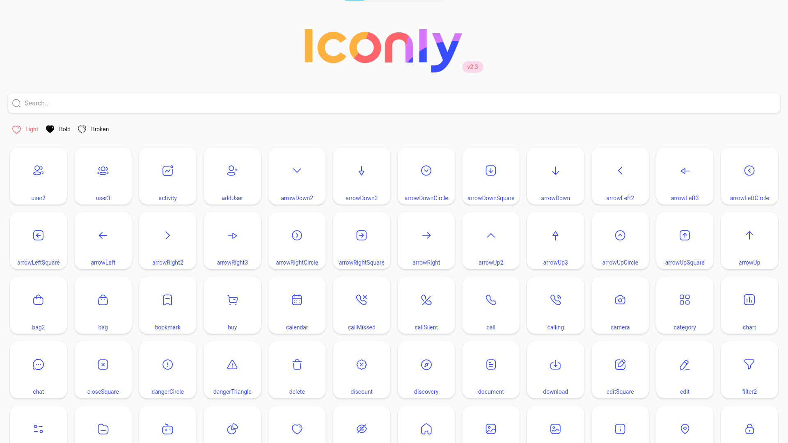

# flutter_iconly

Flutter package for [Iconly 2.3 Essential Icons](https://www.figma.com/community/file/876509330914541878). Flutter iconly is package of more than 300 icons in 3 styles(Light, Bold, Broken).

You can see list name of Flutter Iconly in [Flutter Iconly Web](https://m-noer.github.io/flutter_iconly_web/)

## Screenshot   


## Installation
In the dependencies: section of your pubspec.yaml, add the following line:
```yaml
flutter_iconly: <latest_verion>
```

## Usage
```dart
import 'package:flutter/material.dart';
import 'package:flutter_iconly/flutter_iconly.dart';

void main() {
  runApp(MyApp());
}

class MyApp extends StatelessWidget {
  @override
  Widget build(BuildContext context) {
    return MaterialApp(
      title: 'Iconly Demo',
      theme: ThemeData(
        primarySwatch: Colors.blue,
      ),
      home: Scaffold(
        body: SafeArea(
          child: Center(
            child: Column(
              children: [
                /// Icon Style Bold
                Icon(IconlyBold.user2),

                /// Icon Style Light
                Icon(IconlyLight.activity),

                /// Icon Style Broken
                Icon(IconlyBroken.user2),

                Icon(Icons.ac_unit)
              ],
            ),
          ),
        ),
      ),
    );
  }
}

```

